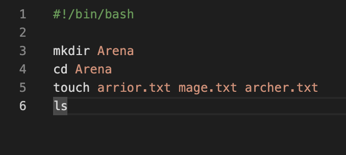
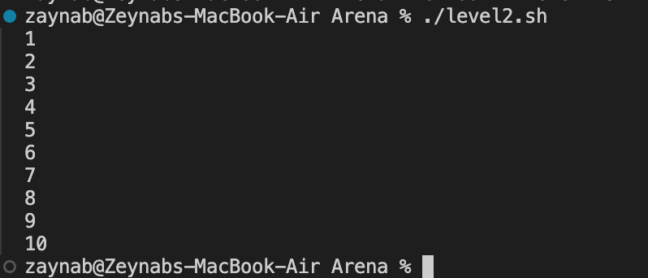
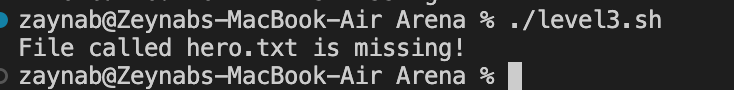
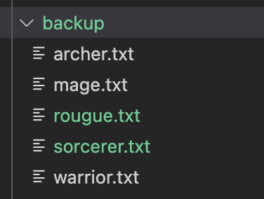
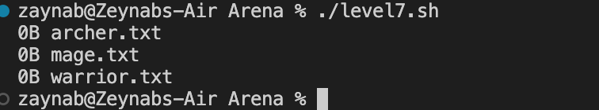
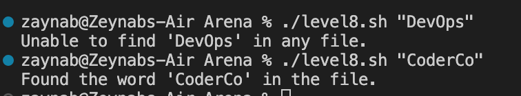

# LEVEL 1
*see the completed Bash script [here](./bash%20battle%20arena/Arena/level1.sh)*

- `mkdir Arena`: Creates the Arena directory.
- `cd Arena`: Moves into the Arena directory
- `touch warrior.txt mage.txt archer.txt`: Creates three files: warrior.txt, mage.txt, and archer.txt.
- `ls`: Lists the files in the Arena directory.

---

# LEVEL 2
*see the completed Bash script [here](./bash%20battle%20arena/Arena/level2.sh)*

- `for i in {1..10}; do`: This creates a loop that starts at 1 and increments up to 10.
  - `{1..10}`: Defines the range of numbers for the loop.

- `echo "$i"`: Inside the loop, each number (from 1 to 10) is printed on a new line.
  - `$i` holds the current number in the loop.

- `done`: This marks the end of the loop.

---

This script outputs the numbers 1 through 10, with each number printed on a new line.

# LEVEL 3
*see the completed Bash script [here](./bash%20battle%20arena/Arena/level3.sh)*

- `if [ -f "./Arena/hero.txt" ]; then`: This checks if the file `hero.txt` exists in the `Arena` directory.
  - `-f` checks if the file exists and is a regular file.

- `echo "Hero found"`: If `hero.txt` is found, the script prints "Hero found".

- `else echo "Hero missing!"`: If `hero.txt` is not found, the script prints "Hero missing!".

---

This script effectively checks for the existence of `hero.txt` and provides appropriate feedback based on whether the file is found or not.

# LEVEL 4
*see the completed Bash script [here](./bash%20battle%20arena/Arena/level4.sh)*

- `mkdir backup`: This creates a new directory called `backup`.
  - This directory will be used to store all `.txt` files copied from the current directory.

- `cp ./*.txt ./backup/`: This command copies all `.txt` files from the current directory into the `backup` directory.
  - `./*.txt`: Specifies all `.txt` files in the current directory.
  - `./backup/`: This is the target directory where the `.txt` files will be copied.

---

This script successfully creates a new directory called `backup` and copies all `.txt` files into it.

# LEVEL 5: 
*see the completed Bash script [here](./bash%20battle%20arena/Arena/level5.sh)*

- `mkdir Battlefield`: Creates a `Battlefield` directory for files.
  
- `cd Battle*`: Changes to the `Battlefield` directory using a wildcard.

- `touch knight.txt sorcerer.txt rogue.txt`: Creates `knight.txt`, `sorcerer.txt`, and `rogue.txt`.

- `if [ -f "knight.txt" ]; then`: Checks if `knight.txt` exists.

- `mkdir -p Archive`: Creates an `Archive` directory if `knight.txt` exists.

- `mv knight.txt Archive/`: Moves `knight.txt` to `Archive`.

- `ls`: Lists remaining files in `Battlefield`.

- `ls ./Archive`: Verifies `knight.txt` is now in `Archive`.

# LEVEL 6
*see the completed Bash script [here](./bash%20battle%20arena/Arena/level6.sh)*

- `FILE="$1"`: This saves the first argument (the filename) passed to the script into the `FILE` variable.

- `if [[ -n "$1" ]]; then`: This checks if the user provided a filename.
  - `-n` checks if the first argument (the filename) is not empty.
  - If the filename is provided, the script moves on to count the lines.

- `Num=$(wc -l <"$1")`: This counts the number of lines in the file.
  - `wc -l` counts the lines in the file, and `<"$1"` sends the file content to this command.
  - The number of lines is saved in the `Num` variable.

- `echo "The number of lines in this file is : $Num"`: This prints the number of lines in the file.

- `else echo "No file provided"`: If the user didn't provide a filename, the script will print "No file provided".

# LEVEL 7 
*see the completed Bash script [here](./bash%20battle%20arena/Arena/level7.sh)*
- `ls -lh`: the file size is displayed in a human-readable format. 
- This option shows sizes in KB, MB, etc., but it **doesn't actually sort the files based on their size.**

- `awk '{print $5, $9}' `: extracts the 5th (file size) and 9th column (file name) ONLY from the ls -l output, which are the file size and file name respectively.

Please note these files are empty - hence the size :) 

# LEVEL 8

*see the completed Bash script [here](./bash%20battle%20arena/Arena/level8.sh)*

- `if [ -z "$1" ];`: This checks if the user has provided a word or phrase to search for.
  - If no word is provided, the script shows an error message and exits.

- `grep -l "$1" *.log > /dev/null`: 
  - This searches for the word (`$1`) in all `.log` files.
  - `-l` lists the names of the files that contain the word.
  - `> /dev/null` hides the actual results, so only the file names are handled by the script.

- `if [ $? -eq 0 ];`: This checks the result of `grep`.
  - If the word is found, it prints "Found the word".
  - If no files contain the word, it prints "Unable to find the word".

