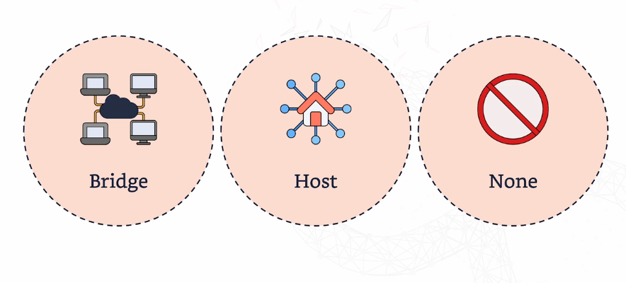

# Docker Networking

Docker provides different types of networks to control how containers communicate with each other and with the host machine.

## Types of Docker Networks

### 1. Bridge Network
- Containers on a bridge network communicate using their own **IP addresses**.
- The network is **isolated** from your host machine's network.
- Most commonly used for standalone container setups where isolation is needed.

### 2. Host Network
- The container directly uses the **host machine's network** without isolation.
- Suitable for applications that need close interaction with the host system, like monitoring tools or when you want to minimize networking overhead.

### 3. None Network
- The container is launched with **no network interface** at all.
- This is useful when you want to **completely isolate** a container from any network, ensuring it has **no external access**.

---

## Docker Networking in DevOps

Docker networking plays a key role in modern DevOps, particularly in microservices architecture.

### Why Use Docker Networking?

- **Simplifies Microservices Architecture**: Microservices allow different parts of an application to run as independent services, each in its own container.
- **Efficient and Secure Communication**: Docker networking ensures that these microservices can **communicate efficiently and securely** with each other, which is critical for distributed systems.

By using Docker networks, you can ensure smooth communication between containers, enhancing security and performance in your infrastructure.
