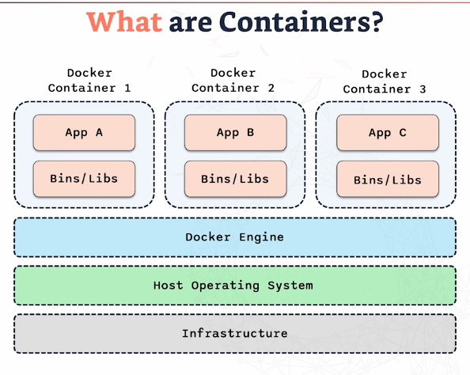
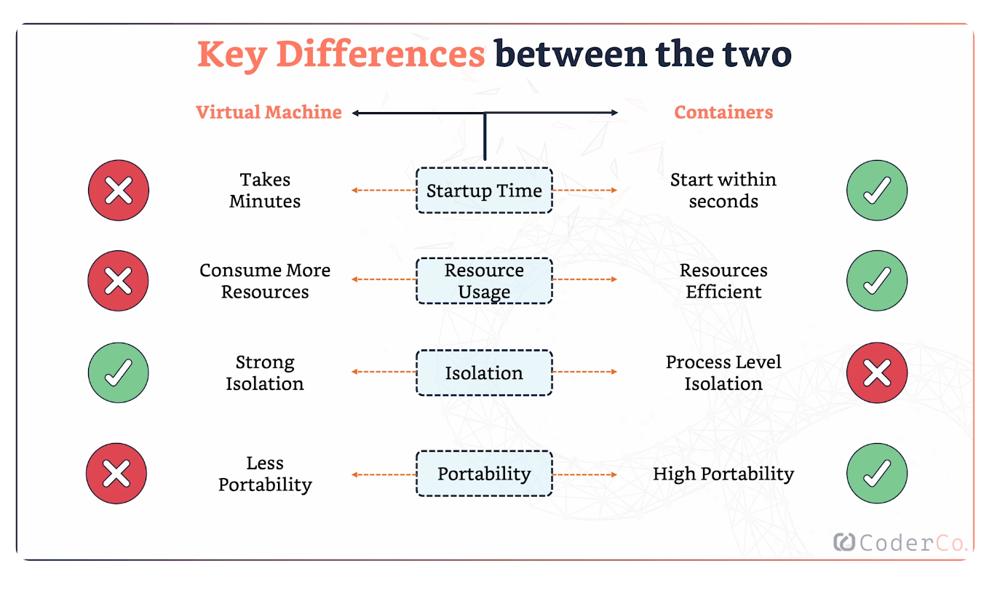

Containers are lightweight, portable units for running applications. Each container packages an application along with its runtime, libraries, and all the dependencies it needs to run. Because containers are isolated, they will run the same on any environment, whether it's your local machine or a production server.

---

# What is Docker?

Docker is a platform for developing, managing, and shipping containers. It simplifies the process of building, deploying, and running applications by packaging everything the application needs to run into isolated containers.

### Key Components:
1. **Docker Engine**: The core service that runs and manages containers.
2. **Docker Hub**: A repository where you can find and share container images. It's like an "App Store" for container images.
3. **Docker File**: A text file that contains the instructions on how to build a Docker image. It's essentially a blueprint for your container.

---

# What Are Docker Images vs Containers?

- **Docker Image**: A Docker image is a blueprint for a container. It’s a read-only template that includes the application code, libraries, environment variables, and configuration files required to run an application.
- **Docker Container**: A container is a runtime instance of an image. When you run a Docker image, it becomes a container. Containers are isolated environments where the application runs, and they share the host OS kernel.

### Summary:
- **Image**: Blueprint or template (static).
- **Container**: Running instance of the image (dynamic).

---

# Virtual Machines vs Docker Containers

Virtual Machines (VMs) and Docker containers both provide environments for running applications, but they work differently in terms of resource use, isolation, and startup time. 

### Virtual Machines:
- **Base Infrastructure**: VM allows multiple operating systems (OS) to run on a single physical machine.
- **Host OS**: This is the primary OS managing all the resources.
- **Hypervisor**: Responsible for creating and managing VMs by allocating CPU and memory. Each VM is completely isolated from the others.
- **Guest OS**: Each VM runs its own full guest operating system (e.g., your host OS is macOS, and your guest OS could be Ubuntu).
- **Binaries/Libraries**: Each VM includes its own binaries and libraries to run an application.

### Key Characteristics of Virtual Machines:
- **Strong Isolation**: Each VM is fully isolated with its own OS.
- **Resource-Heavy**: Each VM consumes significant CPU, memory, and storage because it runs a full guest operating system.
  
---

### Containers:
- **Base Infrastructure**: Containers are a lightweight and more efficient way to isolate applications.
- **Host OS**: Like VMs, containers share the same host OS, but instead of using a hypervisor, they run on the Docker Engine.
- **Docker Engine**: The Docker Engine sits on top of the OS and manages the containers.
- **Isolation**: Containers are isolated from one another, but they share the host OS, making them much lighter than VMs.
- **Binaries/Libraries**: Each container contains the binaries, libraries, and anything the application needs to run.

### Key Characteristics of Containers:
- **Lightweight**: Containers start quickly and consume fewer resources compared to VMs because they don't need to boot an entire OS.
- **Efficient**: Containers use only the necessary parts of the host OS and share the kernel, making them much more efficient in resource usage.

---

### Key Differences Between VMs and Docker Containers

---

### Remember the Acronym: **RIPS**
- **Resource Usage**: VMs use full operating systems, making them resource-heavy. Containers use only what's necessary.
- **Isolation**: VMs have stronger isolation due to the full guest OS, while containers offer process-level isolation.
- **Portability**: Containers are more portable and lightweight, while VMs are bulkier.
- **Startup Time**: VMs take longer to boot due to the need to start a full OS, while containers start in seconds.

---

## Summary: How Docker Containers Work
- Each application runs inside its own isolated **container**, packaged with the necessary binaries and libraries to ensure consistent operation across any environment.
- The **Docker Engine** manages these containers, allowing multiple apps to run simultaneously on the same machine without conflicts, by keeping them separate.
- This is possible because containers share the same **Host Operating System** and hardware (or **Infrastructure**) but not the environment within each container.
- This design makes containers lightweight, efficient, and portable.

---

## Key Advantages of Containers:
- **Consistency Across Environments**: Containers run the same in development, testing, and production.
- **Isolation**: Containers ensure applications don’t interfere with each other, even though they share the same host resources.
- **Efficiency**: Containers are lightweight because they don’t require a full OS within each container, unlike traditional virtual machines.
