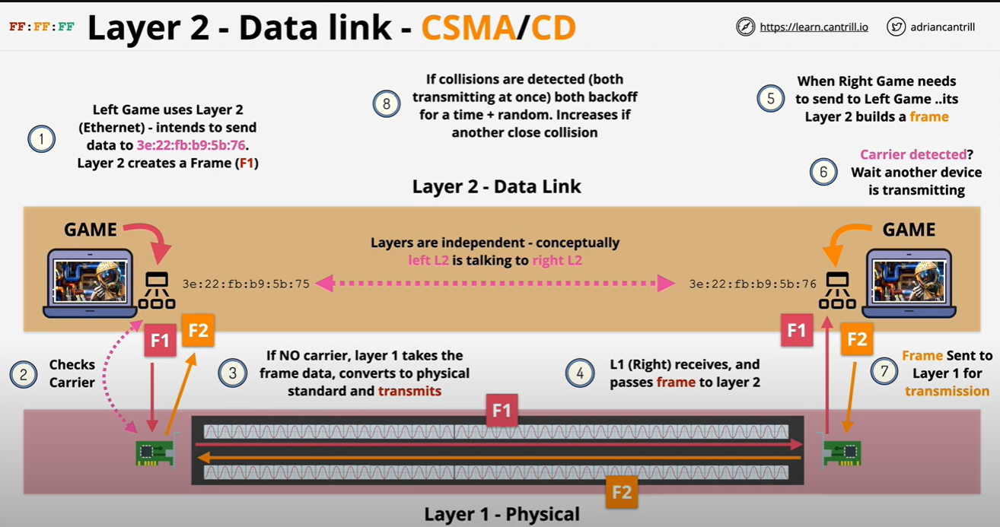
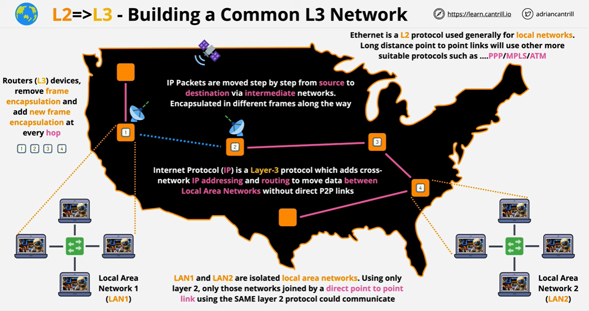
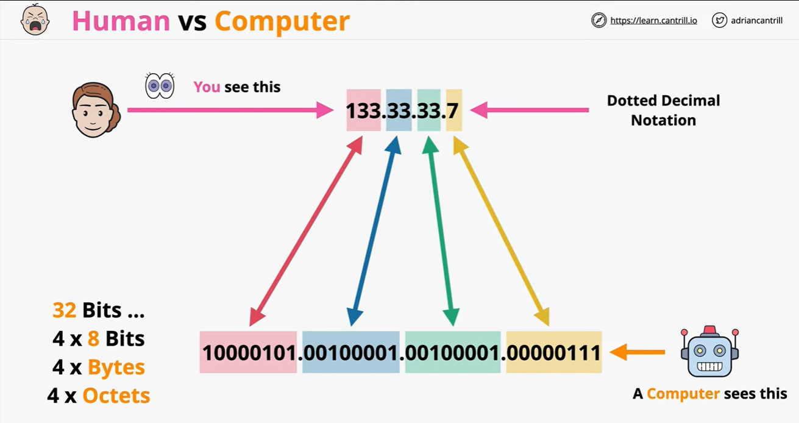
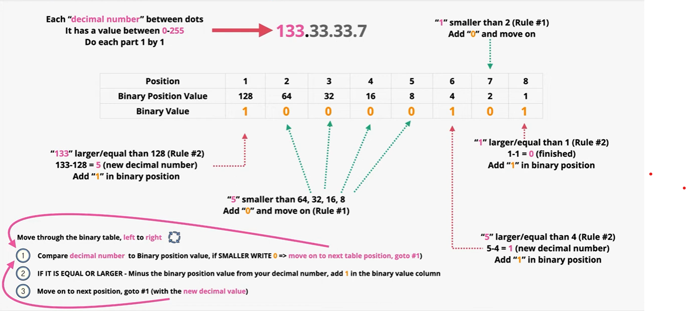
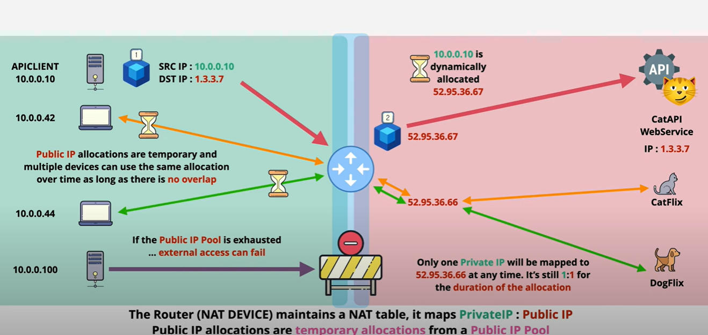
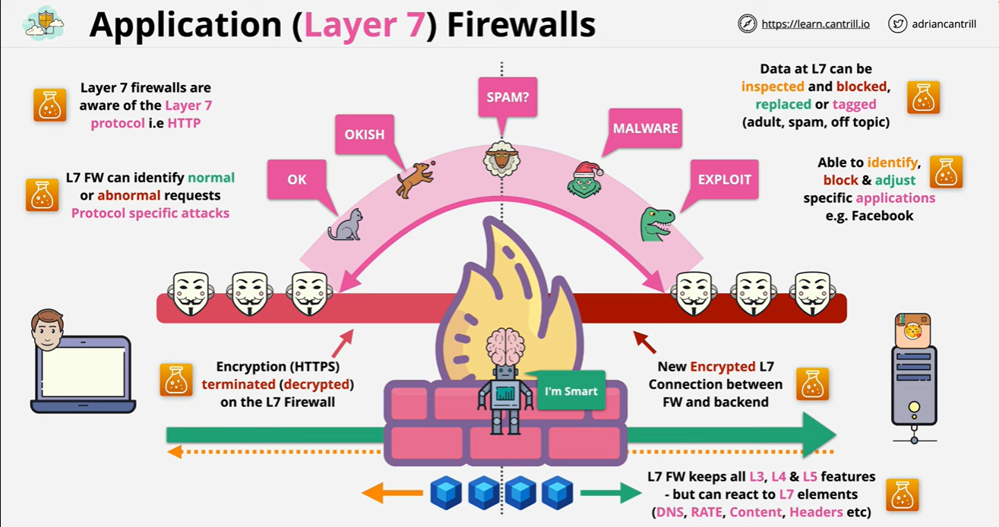

## Table of Contents:
- [What Is the OSI Model](#what-is-the-osi-model)
- [Layer 1 - Physical layer](#layer-1---physical-layer)
- [Layer 2 - Data link layer](#layer-2---data-link-layer)
- [Layer 3 - Network layer](#layer-3---network-layer)
- [Decimal to Binary Conversion (IP Addressing)](#decimal-to-binary-conversion-ip-addressing)
    - [Converting decimal to Binary `133.33.33.7`](#converting-decimal-to-binary-13333337)
- [Layer 4\&5 - Session \& Transport layers](#layer-45---session--transport-layers)
  - [Segments](#segments)
- [Layer 6 - Transportation layer](#layer-6---transportation-layer)
- [Network Address Translation (NAT)](#network-address-translation-nat)
  - [Static Network address translation](#static-network-address-translation)
- [Stateful vs Stateless Firewalls](#stateful-vs-stateless-firewalls)
  - [Stateful](#stateful)
  - [Stateless](#stateless)
  - [Which is better?](#which-is-better)
- [Internet Protocol Security (IP Sec)](#internet-protocol-security-ip-sec)
    - [IKE (internet key exchange)(slow \& heavy) PHASE 1:](#ike-internet-key-exchangeslow--heavy-phase-1)
    - [IKE (internet key exchange)(fast \& agile) PHASE 2:](#ike-internet-key-exchangefast--agile-phase-2)
- [Application (Layer 7) Firewalls](#application-layer-7-firewalls)

# What Is the OSI Model
The Open Systems Interconnection (OSI) model describes seven layers that computer systems use to communicate over a network.

# Layer 1 - Physical layer

- The Physical Layer serves as the foundation of the OSI Model, focusing on the actual transmission of data in its raw bit form over a physical medium. Focuses on the physical shared medium 
- standard for transmitting and receiving from the medium 
-  The Physical Layer doesn't define any particular meaning for those signals other than the basic binary values 0 and 1.
 

- Layer1 has **ONE** broadcast and **ONE** division main : Layer 1 networks don't scale very well. Has higher chance of collisions and data corruption as it RE- TRANSMITS EVERYTHING
  
> [!IMPORTANT]  
> **No access control  
> No uniquely identified devices   
> No device => device communications**

#  Layer 2 - Data link layer

-  Layer two relies on functional layer one networks, which provide various capabilities to higher layers.
-   Layer one handles the physical transmission and reception of frames while **layer two provides them for communication.**
     ## Framing
    - One of the key functions of the Data Link Layer is to divide the stream of bits received from the Physical Layer into manageable frames
    - Framing allows devices to recognize the start and end of each transmission.
    -  This process ensures that data is correctly segmented for transmission over the network.
      ## Network devices
     - The Data Link Layer is crucial for the operation of network devices like switches
     - use MAC addresses to determine how to forward frames
     - This capability enables switches to efficiently direct data only to the specific port where the destination device is connected, **minimizing network congestion and enhancing overall network performance**
      ## Mac Adress:
     - MAC addresses are unique identifiers assigned to network interface cards (NICs) or network adapters.  48-bit long  `00:1b:63:84:45:e6`. These addresses are used to identify devices on a local network segment.
     - When a device wants to send data to another device within the same network, it uses the recipient's MAC address to direct the frame to the correct destination.
     -  The Data Link Layer is **responsible for adding the MAC address information to the frame's header.**
   

  

  > [!IMPORTANT]  
> This layer is responsible for node-to-node communication and error detection  
> 
>  It organizes data into frames, adds physical addresses (MAC addresses) to these frames, and ensures reliable transmission over the physical layer   
> 
> Ethernet is a common example of a protocol operating at this layer.  
> **Contains COLLISION detection**

 

# Layer 3 - Network layer

-  This layer enables devices to communicate across different networks by routing data packets. It's where logical addressing, like IP addresses, comes into play. 
-  Routers operate at this layer, using logical addresses to make decisions about how to forward packets towards their destination. 
 -  It's responsible for determining the best path for data to travel across interconnected networks.
  
     ## Routing Packet and Packet forwarding
       - One of the fundamental tasks of the Network Layer is to route data packets from the sender to the receiver.
       -  It accomplishes this by determining the most efficient path for data to travel through a complex network topology.
       -  As data packets traverse the network, the Network Layer handles **packet forwarding**.
       -  This involves inspecting the destination IP address in each packet's header and determining the next hop (next network device) on the route to the destination.
       -   The Network Layer also manages the encapsulation and decapsulation of data packets for transmission and reception.
  
     ## Error Handling 
       - While the primary responsibility for error handling lies with higher layers, the Network Layer may perform basic error detection and reporting.
      -  If a packet is found to be corrupt or undeliverable, **the Network Layer may discard it or request retransmission.**
  
     ## Logical Addressing
       - Each device on a network is assigned a unique address known as an IP (Internet Protocol) address.
       -  IP addresses, both IPv4 and IPv6, are used for identifying devices and their network location.
       -  Responsible for managing these addresses, which are used for source and destination identification in data packets.
   
     ## Inter-Network Communication
       - The Network Layer is crucial for enabling communication between different networks. 
       - It acts as the boundary where data moves between local area networks (LANs) and wide area networks (WANs).
       -  Routers, which operate at this layer, play a central role in **connecting disparate networks and ensuring data can traverse these boundaries.**
  
  

  > [!IMPORTANT]  
>  - The network layer handles moving data **from the SOURCE to the destination**.  
>  - It's responsible for logical addressing (like IP addresses), packet forwarding, and traffic control.   
> - Routers operate at this layer to determine the best path for data to travel across interconnected networks.  
> - Allows for Device <=> Device communication over the internet
> - Provides **NO** method for channels of communication  
> - Can be delivered out of order ..

# Decimal to Binary Conversion (IP Addressing)
  - Decimal to binary conversion in IP addressing involves transforming the standard decimal notation of an IP address into its binary equivalent. 
  - This conversion is essential for computers to understand and process IP addresses, as they communicate in binary format at the network level. 
  

  ### Converting decimal to Binary `133.33.33.7`

Following the method above you continue for 133.**33.33.7** to get : 

# Layer 4&5 - Session & Transport layers 
-  The Transport Layer (Layer 4) ensures reliable end-to-end communication and data delivery across networks. 
-  It segments data into manageable pieces, manages flow control to prevent congestion, detects and corrects errors, and multiplexes multiple data streams. 
-  It supports both **connection-oriented (TCP) and connectionless (UDP)** communication, vital for various applications like web browsing and real-time communication.
   - **TCP is slower but more reliable**
   - **UDP is Faster but Less reliable**   
  
*Both use IP as transit, TCP just offers a more reliable  connection while UDP is all about performance*

   ## Segments
   - One of the key roles of the Transport Layer is to divide large messages into smaller segments, making them easier to transmit across the network.
   - These segments are typically referred to as “packets” or “datagrams.”
   - Segmenting data is especially important when the message is too large to fit into a single network packet.
  
> [!IMPORTANT]  
>The Transport Layer allows for multiple services to run simultaneously on a single device, supporting various applications and facilitating secure data transfer over encrypted connections.

- The Session Layer (Layer 5):
   -  establishes
   -  maintains 
   -  terminates communication sessions between devices.
-  It **ensures synchronized and reliable data exchange**, handles session setup and termination, manages dialog control to prevent conflicts, and implements synchronization points and checkpointing for resuming interrupted sessions. 
-  It's crucial for applications like file transfer, remote desktop connections, and online gaming, where maintaining a seamless user experience is essential.
  
# Layer 6 - Transportation layer

   - The presentation layer, prepares data so that it can be used by the application layer (layer 7)
   - It handles translation, encryption, and compression of data, ensuring compatibility between communicating devices.
   - Layer 6 **translates incoming data** into a format understandable so that it can present the application layer with unencrypted, readable data.

# Network Address Translation (NAT)

- NAT is designed to overcome **IPv4 shortages**
- To give internet access to private devices we need to use Network Address Translation (NAT)
   - Translates **Private** IPv4 address to** Public**
- NAT also provides some security benefits 
-  private addresses in a network architecture are unable to communicate directly with public internet-based services due to the private and public addresses being incompatible for direct communication. 
-  To solve this problem, Network Address Translation (NAT) is used to translate private addresses to public IP addresses that can communicate with the services.
  
    ### NAT has three basic protocols: Static, Dynamic and Port Address Translation (PAT):

  
   ## Static Network address translation  
      -  With Static NAT there will be a fixed public address for every privately IP addressed device that needs to send information across the router. S**o, if you need more than one device on the private network that needs access to the internet you will need multiple public IP addresses.**
  
     ## Dynamic Network address translation 
      - Dynamic NAT allows devices to temporarily borrow public IP addresses from a pool instead of being permanently allocated one. An example is given where four devices require public addressing, but only two public IP addresses are available. 
      - Multiple private devices can share a single public IP as long as they use the allocations at different times.
      -  However, if all public IPs in the pool are in use, access to the internet will fail. 
  
     

      ## Port Address translation (PAT)
      -  PAT is an advanced, more flexible type of dynamic NAT. PAT maps several private IP addresses to a single public address at the same time. 
      - PAT works by assigning unique port numbers to each connection session to distinguish between them.
      - The NAT table holds all the critical information regarding which public IP/port combination has been mapped to which private IP/port combination. So, one public IP can represent multiple private IP addresses by using unique port numbers.

> [!IMPORTANT]  
> **PAT is the most widely used and trusted form of NAT. The diagram below gives a description of how PAT operates:**         
 

   # Stateful vs Stateless Firewalls
  Stateful and stateless firewalls are two fundamental types of network security devices that filter and **control the flow of traffic between networks.**

   ## Stateful 
   - **Stateful** firewalls maintain state information about active network connection
   - It is like a smart security guard who remembers past interactions. It keeps track of the state of active connections passing through it.
   - If a data packet leaves your network, the stateful firewall** remembers where it came** from and where it's going.
   -  If a response comes back, it checks to see if it matches a known, approved connection. It's like recognizing a visitor you've already let in.
  
  ## Stateless 
- **Stateless** firewalls examine each data packet passing through it in isolation, without considering past connections. It checks the packet against predetermined rules, like a checklist.
-  If the packet meets the criteria, it's allowed through; otherwise, **it's blocked**.
-   It doesn't remember past interactions or connections—it just follows the rules.

## Which is better?
1. **Stateless for smaller businesses** - Because there is bound to be less incoming traffic than with a large enterprise, there may also be fewer threats. This could make them relatively straightforward to set up by a small business owner.
2. **Stateful firewalls for larger enterprises** - Because they offer dynamic packet filtering, they can adapt to a variety of threats using data gathered from previous network activity to ascertain the danger level of novel threats.

#  Internet Protocol Security (IP Sec) 
- They are Group of protocols that work together to:
   - set up a **secure networking tunnels across insecure networks**
   -  It is often used to set up VPNs, and it works by encrypting IP packets, along with authenticating the source where the packets come from.
 - IPSEC has 2 main phases in setting up a VPN connection
  
  ### IKE (internet key exchange)(slow & heavy) PHASE 1:
  The main purpose of IKE phase 1 is to establish a secure tunnel that we can use for IKE phase 2.
    
  1.  The phase involves authenticating routers at both sites using certificates or pre-shared keys.
  2.  Then the Diffie-Hellman key exchange, through which each side creates its own private key and a corresponding public key that is exchanged. 
  3. After both private and public keys are exchanged, each side uses the public key of the other party and their own private key to derive the Diffie-Hellman key, which is then used to exchange key material and agreements. 
  4. Finally, a symmetrical key is generated, which is used for encryption. 
   
 **Phase two is used to agree on how the VPN will be constructed, and it is built on top of phase one to form a security association.**
### IKE (internet key exchange)(fast & agile) PHASE 2:

In Phase 2 this is where the actual secure data transmission parameters are established
   1.  Each VPN side sends a proposal containing encryption, authentication, and other parameters for securing the data transmission.
   2.  The sides compare proposals and select a mutually acceptable combination of security parameters for Phase 2
   3. With the method chosen, they set up a secure connection. They exchange keys and other info needed to talk secretly. 
   4. With the SAs established, data can be securely transmitted
   5. During Phase 2, the SAs are maintained by periodically renegotiating security parameters or rekeying to ensure ongoing security.

> [!IMPORTANT]  
> **In summrary - Phase 1 of IPsec VPN negotiation is like setting up a secret phone line between two friends. They agree on how to encrypt their messages and make sure they're talking to the right person. Once they're sure they're safe, Phase 2 is about deciding how to talk securely and creating a connection to exchange messages without anyone eavesdropping.**   

# Application (Layer 7) Firewalls

 Interacts directly with users and provides network services to applications. It's where applications like email, web browsers, and file transfer programs operate, allowing users to interact with the network.

Most user-facing protocols and applications like HTTP, FTP and SMTP operate on layer 7.
 
   - Layer 7 is designed to protect networks by inspecting and filtering traffic at the application layer of the TCP/IP stack
   - Application layer firewalls can understand and interpret the content of network packets, making them more effective at detecting and blocking specific types of threats.

