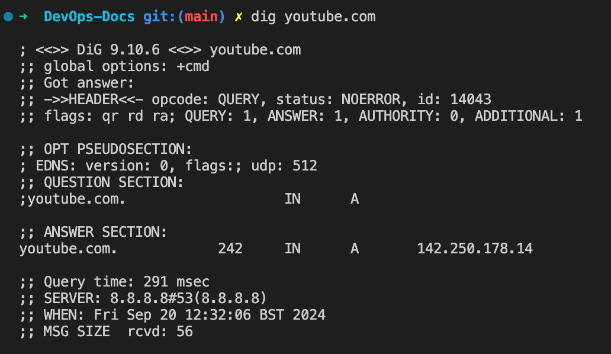

# Lab 1

Ns lookup on Youtube

1. `nslookup youtube.com `

Looks like youtube is using google's DNS server 8.8. 8.8

2. `dig youtube.com`
 

- The IP address returned 142.250.178.14 - likely belongs to Google’s infrastructure. Google owns YouTube, and their traffic is managed through Google's CDN

# lab 2 binary conversion 

1. ## Convert 10.0.0.1 to binary 

**My answer:** 00001010.00000000.00000000.00000001

2. ## Convert 255.0.0.0 to binary 
**My answer:**  11111111.00000000.00000000.00000000
